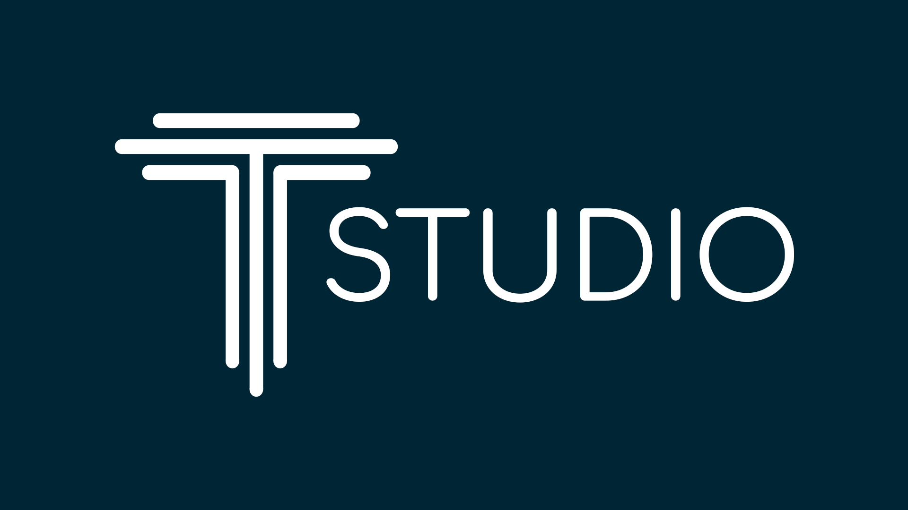

Trust studio is a tool for evaluating and analysing trust and uncertainties
in business process models annotated with [BPMN](https://en.wikipedia.org/wiki/Business_Process_Model_and_Notation).
This web application combines various tools and utilities to be able to evaluate all relevant aspects 
of the selected bpmn file.

The general idea is based on research conducted by Marcel Müller et. al. and is thus a practical implementation
of the "trust mining" process.
 
You can find a working demo of this project **here**: 
##### [trust.snet.tu-berlin.de](http://trust.snet.tu-berlin.de/)

This project was completed under the supervision of 
[Marcel Müller](https://scholar.google.de/citations?hl=en&user=n5r-1sUAAAAJ) and with the help of 
the [SNET team](https://www.snet.tu-berlin.de/menue/service_centric_networking/welcome/) at TU Berlin.

## Code conventions
- UpperCamelCase for files and modules, camelCase for variables and other
- types that are more complex than three key-value-pairs need to be defined in the model directory
-  Separation of concerns: components, pages, model, resources and util

## Available Scripts

In the project directory, you can run:

### `npm start`

Runs the app in the development mode. 
Open [http://localhost:3000](http://localhost:3000) to view it in the browser.

The page will reload if you make edits. 
You will also see any lint errors in the console.

### `npm test`

Launches the test runner in the interactive watch mode. 
See the section about [running tests](https://facebook.github.io/create-react-app/docs/running-tests) for more information.

## Libraries used APIs used

##### Bootstrapped with [Create React App](https://github.com/facebook/create-react-app).

### Libraries

- [material-ui](https://material-ui.com/)
- [Material table](https://github.com/mbrn/material-table)
- [Reactour](https://github.com/elrumordelaluz/reactour)
- [react-chartjs-2](https://github.com/jerairrest/react-chartjs-2)
- [react-d3-graph](https://github.com/danielcaldas/react-d3-graph)
- [notistack](https://github.com/iamhosseindhv/notistack)
- [react-pdf](https://github.com/diegomura/react-pdf)
- [html2canvas](https://github.com/niklasvh/html2canvas)

#### bpmn.io

- [bpmn-js](https://github.com/bpmn-io/bpmn-js)
- [bpmn-moddle](https://github.com/bpmn-io/bpmn-moddle)
- [tiny-svg](https://github.com/bpmn-io/tiny-svg)

